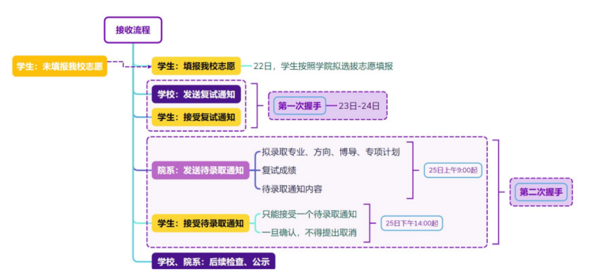
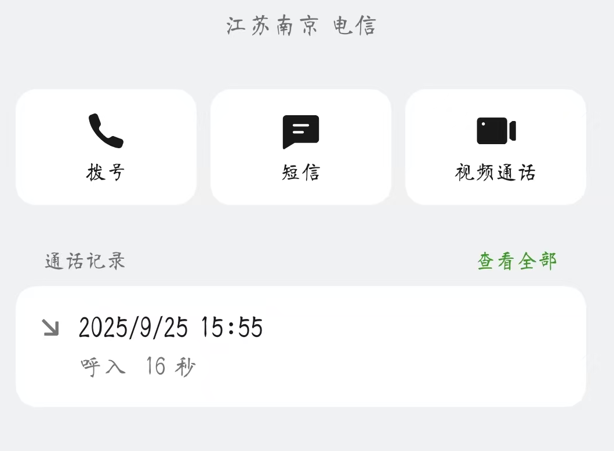
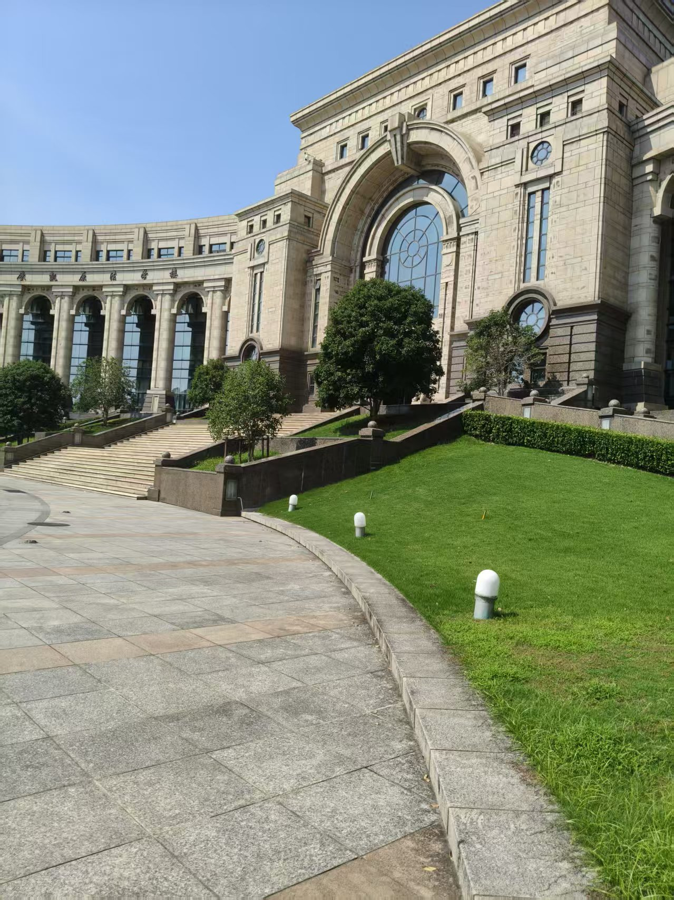
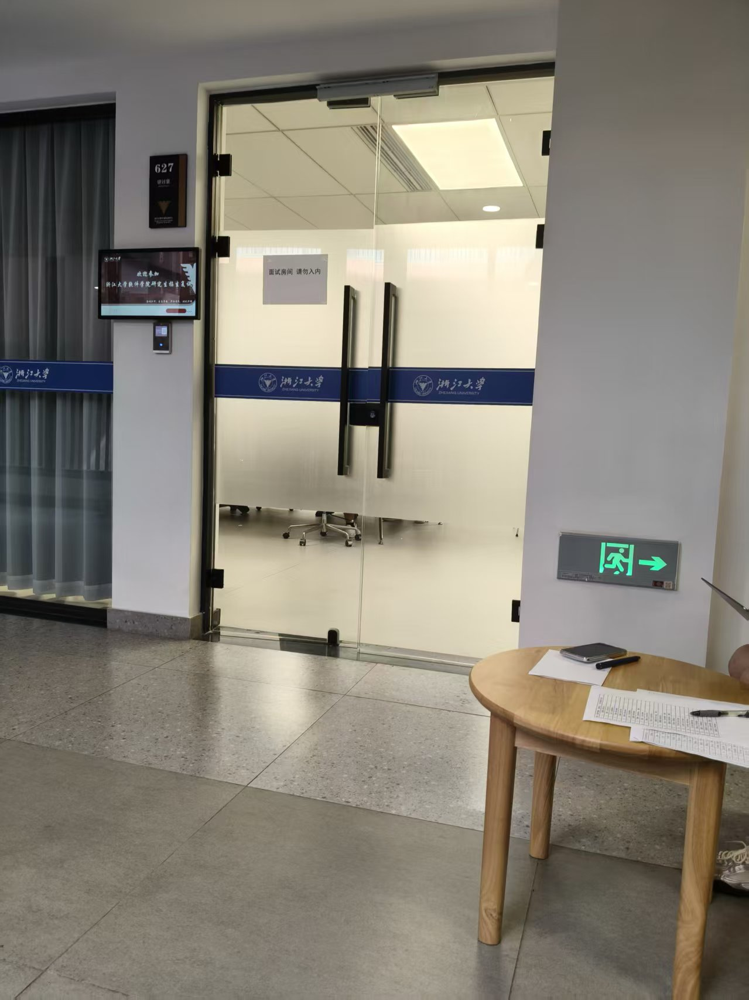
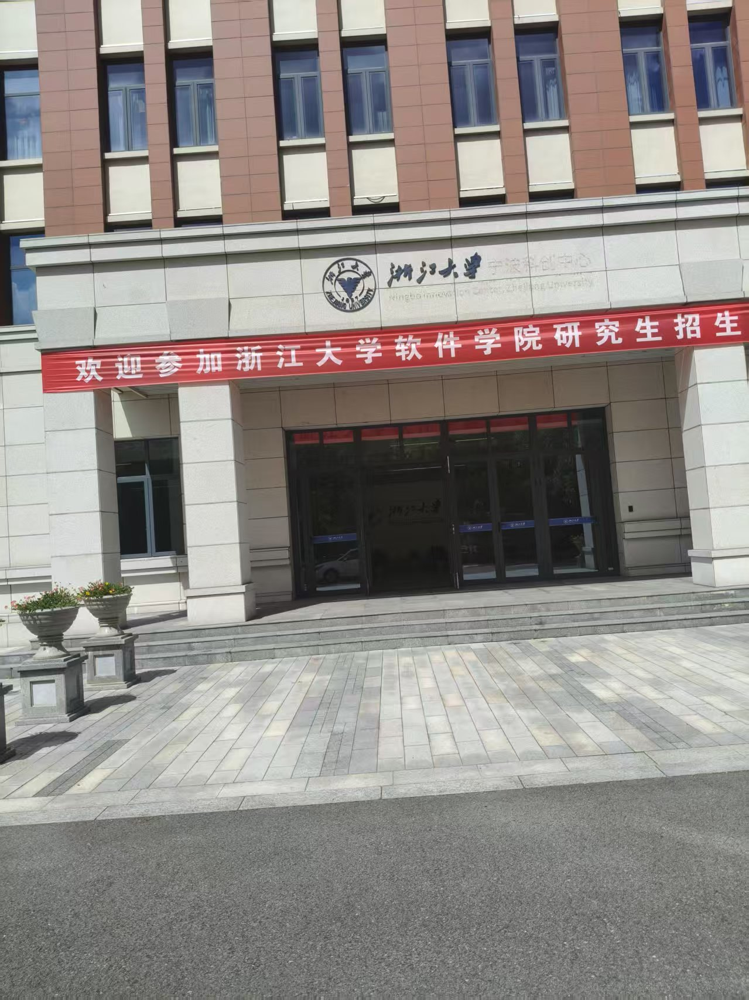
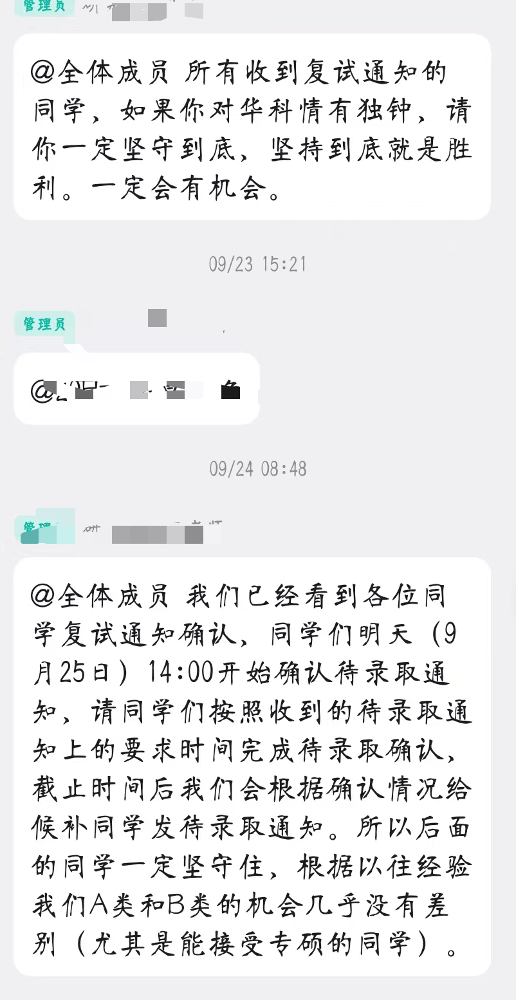
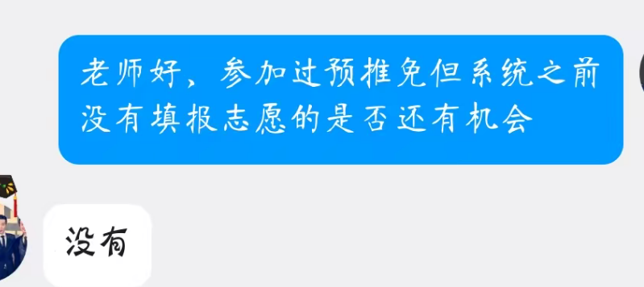

### 东南大学计算机科学与工程学院

东南的夏令营就是预推免，硕士分为计算机学硕、计算机专硕、软件专硕几个队列，入营和发优营都是按队列分开来，因此报名时需要斟酌一下，今年计算机专硕方向就炸了，报的多优营少，如果实力不强但想要较容易拿offer建议报软件专硕，基本没什么区别，导师也基本都是同一批，也可以根据导师的建议报考。外校的学生需要联系导师才有入营资格，每个老师手里名额有限，如果要去PALM这样的大组更要提前联系。有的老师会组织任务考核或者线上面试，这个就因导师而异了，老师承诺推荐后基本上就能保证入营了。

关于考核，东南只有15\-20分钟的面试，因此对于机试水平差的同学相对友好，但这也更加对你的个人背景有较高的要求，按报名的方向计学、计专、软专，分三天进行面试，提前一天晚上在群里发布面试次序，只需要在自己面试的时段提前过去候场即可。面试计时，主要的材料是PPT和个人信息表（都有模版），其他材料仅作为备查。按PPT和信息表内容主要包括：基本情况、学术成果、奖励情况、实践经历、个人爱好，PPT有页数限制，做好可以发给联系的导师看看，有的老师会给你修改建议。面试包括：限时讲自我介绍PPT\+英语问答\+专业课\+科研项目。我被问到的问题如下：

英语：介绍一下XXXX实践中的贡献

项目：数据是哪里来的、数据清洗处理流程以及项目细节问题和项目涉及到的技术解释

专业课：死锁的四个必要条件；流量控制和拥塞控制的区别；流量控制只用一个窗口行不行，为什么要设置两个窗口；

英语其他人也有被要求自我介绍的、解释一个深度学习算法的、说说你怎么debug的，很杂，而且是英语问英语答，老师的声音小容易听不清。我对这个英语问题完全没准备，胡乱说了一下糊弄，项目和专业课答的还可以，最后的流量控制为什么设置俩窗口的问题被卡，所以专业课不只要背诵，还要有延伸思考。我的场次比较靠后老师也很累，没到时间就把我放出来然后他们去休息了。后面联系的导师说他们有个组里的导师在那个房间说应该还OK，当时有点心安，不过隔了一周多结果出来排名170\-180，基本无望。还是比较吃没有论文的亏，在场的尽管是专硕也差不多人手两篇文章起步，还是太卷了。东南这边联系的导师很好，虽然联系的比较晚还是拿到了最后一个推荐名额，还帮我改了PPT，关注我的面试情况，还是很可惜没能来这边的。

9\.25当天东南疑似优营超发，从名单1号开始挨个打电话确认后才发拟录取通知，但没出现往年穿的很离谱的现象。东南蒙纳士穿了，四个名额过六级，线下来面过试就能拼手速先到先得。

从联系的导师给我改PPT的建议来看，以下几点是比较重要的点：专业靠前的排名、国家奖学金、国家级竞赛奖项、有成果的科研、项目中的个人贡献。

### 南京大学计算机学院

南大计算机八月初发了预推免通知，一周时间报名，今年夏令营无效力也导致两批次考核合并，初筛大概放进来一千人可能，然后线上测试去掉一大半进入线下，线上测试单选\+多选，因而南大计算机学院也被坊间流传不要运气不好的孩子。

接到南大的初筛通过还是比较意外的，因为夏令营被拒了，推测211大概是必需专业前几名，8月20多号参加线上测试，和入营通知相差一周，因此最好提前准备线上测试，但实际情况是准不准备好像没太大用处，考核题目408\+编译\+编程语言，考核内容难度较大较偏，大部分篇幅都在考编程语言和编译，内容偏底层，少部分408的内容，我是基本靠蒙的，不过很幸运入了线下，结果当天晚上就出了，效率还是很高的。如果提前深入准备其实还是有效的，否则也可以赌一下自己的运气，不过今年由于机试拉不开导致线上笔试也作为了综合排名成绩的一部分，所以也还是要重视的。

南大线下三天，由于所有通知都是邮件发过来的，所以要经常关注，否则可能错过重要消息。第一天上午报道，着实被名单吓了一跳，随便望去都是中上层985，下午导师开放交流咨询。第二天机试。第三天面试。个人觉得导师开放交流这个环节还是不错的，像招聘会一样每个课题组有海报，然后老师就在旁边，感兴趣可以过去交流了解，一下午时间可以把每个组情况都了解的差不多，有的老师也会现场传授你一些面试的技巧。这个阶段可以去套磁老师，也可以只做观望了解，有的老师表示拿到线下通过以后来联系就会接收，通不过提前联系也没用，南大的老师都很好，没什么架子可以很自由的交流。机试就比较硬核了，三道题目，全英文题目，自编OJ，可以看到通过哪些测试点，按测试点计分，题目是操作系统网课名师jyy命制，今年貌似没掌控住火候，导致大部分都在只做对一题加后面骗到少量分的区间，jyy的知乎上发布了题目，有兴趣的可以看看，也在网上引发了很大的争议。

[https://zhuanlan\.zhihu\.com/p/1946176384578856692](https://zhuanlan.zhihu.com/p/1946176384578856692)

我没ACM 经历，只是刷过力扣，拿到了60分，当时觉得第一题如果慢慢做是可以100分的，但是贪图后面的题目而选择了存整图，拿了60分去死磕后面的，结果是这个选择是错误的，应该去慢慢做第一题拿100分，后面两道题完全超出我的能力。

南大面试是双盲，老师不知道你的院校也不会让你自我介绍，非常之公平，现场分组然后等待，一进屋上来就英文问题着实有点突然，非常紧凑的10分钟，我被问到的问题包括：

英文（老师用的中文）：1分钟介绍一下操作系统

专业课：中断是啥，没有行不行，中断的过程，哪些硬件哪些软件处理，软硬件处理有什么不同

二叉搜索树是啥，最坏情况下什么样子，怎么解决，红黑和avl，avl是啥，怎么调整

现在南大计算机也开始注重科研背景了，每个人基本都问了一下有没有科研经历，简单介绍一下，不过没有深入问细节问题，只是了解成果。

今年南大计算机开始招收软件工程专业，因此统计了你的意向，然后分开排队录取和候补，又是博弈，软件名额少但是大佬也会少，计算机大佬多鸽子也会多，所以要谨慎选择。隔了一周多出了结果，按照队列和排名发学硕和专硕，我是候补，选的计算机方向打算等鸽子，但是南大可能为了工程硕博招生方便所以先没公布等待候补的名次，工程硕博的报名人数也是达到了很恐怖的报录比。

这只是还在报名当中的某一天的截图：

后面工程硕博结束后就可以查询排名了 ，我在110\-120区间，感觉希望相对渺茫，但又想起南大老师说往年只要进到线下基本都有机会，遂决定等待，南大后面每次邮件都在询问要不要放弃，而且这俩字都很红很大哈哈哈哈。

南大特意发了录取流程，非常有意思的“两次握手”，不愧是计算机

9\.25前夕开始少量候补成功10个左右，9\.25当天2点以后开始缓慢候补，南大候补效率太低，一个一个打电话联系，相比浙软钉钉群通知慢了太多。导致很多人两点半保底院校的拟录取最后期限到了不敢等，我没有保底等到3点半也慌了，只能通过交流群来了解模糊的候补动态，于是匆忙联系其他学校接受了拟录取，结果刚点完10分钟，南大的电话来了，一看是南京的号码顿时捶胸顿足，接了电话我真的当时一句话都说不出来，老师反复喂了好几次我才说已经接了其他学校了，无语又无奈，果然还是勇敢者的游戏。南大是真的挺喜欢的，面试完逛了一圈学校，很大，既有理工氛围也不失人文气息，课题组方向也都不错，除了仙林校区偏了点加之专硕没宿舍感觉没有其他缺点，完全符合我对学校的期望，擦肩而过也是想来可惜了，回想面试结束后每天都在小红书关注有无新进展然后祈祷，若是再坚持10分钟或许就好了，可是没有如果。

南大的考核是我见过最公平的，甚至被本校生吐槽，实力大于一切。

（南大打来的电话）

### 复旦大学计算智能与创新学院

复旦今年夏令营入营的人数照比往年多出不少，放进了700有余，预推免又放进了200多人。我在夏令营阶段是入围候补，预推免拿到了入围面试。复旦是出名的卡rk1 ，所以想来一定要卷一卷排名。9月16日，从南大回来后再次开启面试的旅程。由于今年的推免录取工作提前，不少学校都挤在这一周，但想想还是决定冲一下，于是拒绝了华师、川大、天大、中科院网络中心、山大等一众入围，现在想来可能这个决定不算正确，对于当时的我而言迫切需要的是一个稳offer，但头脑一热还是决定all in 复旦。

复旦是两天，第一天英语口试\+填志愿\+机试 在邯郸校区，第二天面试在江湾校区。早先网络就流传这一批是夏令营候补之后的候补，到现场发现好像复旦确实不太重视，比较混乱，没有引导，邮件通知也比较混乱。

复旦把口试单拎出来难度就提升了不少，其他学校只是象征性问一两个问题，这个三分钟完全可以对话几个轮次，在一个小会议室里面好几个老师，不过还是一个老师主考，英文问，英文答。我是先自我介绍，然后介绍一个项目和你的贡献，然后问了项目的数据量，数据从何而来，感兴趣的研究方向，回答的相对顺利。

中午填志愿，你能看到实时的填报情况，这一点还是不错的也很刺激，不过点开填志愿的界面大家都傻眼了，专硕可能一共十多个名额，学硕更少，开放的方向基本都是1个名额，大部分名额都是直博的，这里部分同学直接跑路了，最后专硕开放的几个专业报录比基本在1:6左右 。 当天由于并没组织休息教室，大家都坐在逸夫楼的一楼大厅地上呆呆的望着不几个名额，然后来回跳转。复旦的选方向还是相当重要的，后面的面试会按报名的方向分组面试，对应方向的老师来面试，所以要不要为了人少的专业报不了解的方向也是博弈。

下午开始机试，应该是四道题来着，小红书上可能能搜到分享，依稀记得有给二叉树前序中序输出后序遍历、力扣上的编辑距离原题、还有一个给国际象棋棋盘的走前后走后，判断走法是否合规，还有一个绩点计算相关的问题。赛制是看不到你的提交情况的，同蓝桥杯。最终实际参加机试人数124人，跑路了不少。

第二天的面试分组进行，我选的是智能软件，这里就是坑了，当时只是因为报录比相对高来的，完全不了解他们做的是什么，自我介绍结束就被问对哪个方向感兴趣，完全答不上来，胡说一同把老师逗笑了，于是转向问专业课，专业课问的也很奇怪，上来问做软件开发用没用过git，回答用过，然后开始问git相关的知识，如说一下协作的流程，commit背后发生了什么，怎么解决冲突的，所以平时课本没有的还是要了解一些，答得磕磕绊绊。然后问我数据库，怎么优化检索，我以为问的是语法查找树的优化，但其实是想问索引，然后问索引怎么实现的，我说B\+树，为啥用B\+树，又开始问数据库物理结构的内容，答得非常糟糕。然后开始问项目相关的内容，老师并不感兴趣，所以问的很浅显，最后又问了一下机试第一题的思路和我算法的时间复杂度。面完就已经预知到结果了，或者说当他问我感兴趣什么的时候就已经结束了哈哈哈哈，再次喜提候补。可能当选人工智能方向会面的舒服一点吧，不过这边提前联系导师推测有点用，因为分小方向面试，基本组里的老师都在。

复旦专硕八万\+没宿舍，学硕基本拿不到，且外界对其实力评价不一，还是要提前了解一下，不过毕竟还是复旦嘛。

（非常美丽的江湾校区）

### 浙江大学软件学院

上午刚在复旦江湾面试结束，然后就坐上了去宁波的高铁准备晚上的浙软机试，浙软今年新校区投入使用，让他的热度继续上升，如今来面试的985本的屡见不鲜。

机试和面试都不在新校区，是在宁波理工这边，机房很破旧，像上个世纪的产物，监考态度也非常恶劣，拿着大喇叭到处喊，18:00正式开考，之前完全不让碰鼠标和键盘，不允许打开IDE调试，也是很难评了，反正大家也看不到赛题，但他们动真格的，现场请出去了几个动鼠标的现型。电脑也很老旧，位置排布也很密集，体验感非常之差。说回到题目，往年浙软题目评价中等，不少拿满分的，今年相对奇怪，但我做题的时候还没意识到这一点，四道题目围绕一个背景展开，第一题没高深的算法，主要可能坐标会搞蒙你，考察细心，于是让一批人没拿到满分，而第一题是后面三题的基础，第二题应该算力扣DFS原题的变形，后面好像还有计算几何。我做的时候认为应该会有大佬拿满分，然后一众人三题搞定，结果是最高分80\+，大部分人两道题\+三题部分分。我拿了43分排140多，总共可能500人不到，机试已经不算拖后腿，不过大家分数都不高同样导致拉不开距离，加之机试只占15%，因而重头戏在面试。

我面试排在了第二天的场次，因此中间空了一天，本来打算飞到西安面西交软件，然后再飞回来面试，可是浙软晚上9点机试结束，没有离开宁波的高铁了，遂放弃，于是中途改为线上面试武大AI学院（命运的齿轮hhh）。

面试需要PPT\+简历，其余材料备查，均无模版可以自由发挥。根据老师指示，一般先英文自我介绍然后开讲PPT，后面是两道专业课\+项目问答。专业课我被问到的是：

数据库四个特性：当时脑子里只剩下ACID，中文完全不记得，说了原子性一致性

然后让我解释一致性：我回答了一下，然后老师说这是隔离性。。。。走出考场想起来D是持久性

然后问计网：输入链接敲下回车到看到页面通过了哪些协议  

然后就是项目问题了，关注点依旧在数据方面，简单了问了一些技术细节。

还有一个象征性的问题：导师给你指派的任务你不喜欢怎么办，然后又问了一下机试情况就结束了

面试老师的态度很好，也会适当指引，项目部分更像是在讨论。

面完浙软感觉相对可以，其他考场专业课甚至有问到线性代数，所以自己的简历一定要好好斟酌，我还是特意起早重新打印的简历 ，这个选择还是比较正确的。

在华科等待面试的时候看到了浙软，候补排名60\-70，又是候补有点无奈，于是华科也摆烂的面的，不过又觉得这个排名相对靠前，可能有戏。

浙软候补很利索，钉钉群里面动态通知谁补上了，但也因为利索所以大家都在蹲，下午不到三点录取工作结束，最后止步五十七八左右，无缘，心死，退出钉钉群。

浙软新校区修好加之学院导师大都年轻，放实习的多，方向也相对热点，报名的人越来越多，如果不在乎不在主校区性价比很高了。按这几年的情况，候补40内基本是稳的，而且候补再上去的反而拿的都不是专项，如果候补50\+还是尽早找好其他学校吧。

（面试现场）

### 武汉大学人工智能学院

武大人工智能是24年末新成立的学院，从计算机学院里面拆分出来的，迎合人工智能热潮，学校也是很重视建设，大部分老师还是与计算机学院有联系的。武大夏令营阶段计院和AI院基本都是非985不要，另外也本校保护。预推免AI院放了大部分人进来，差不多三四百。主要原因在于夏令营期间流传学硕名额不多（当时传只有10个 还有一众名校大佬以及武大本校人竞争），专硕两年制一年八万。

武大AI是线上腾讯会议，只有面试，由于当时没法去西交了，于是在宁波的酒店里面试的武大AI。3分钟个人展示\+3分钟问答，根据分组决定是否使用PPT，但是面试当天才告诉，我当时觉得放这么多人加面试流程非常草率觉得概率不大，像是给夏令营优营走流程的，于是并没准备PPT。

自我介绍后是英文问题，对面的麦很不好还不开摄像头，完全听不清，一直在让老师重说，老师也很不耐烦。英文说一下研究生阶段的规划，然后没有专业课问题，直接就是问项目了,最后问了一下报了哪些其他院校。非常轻松的结束了面试，我报的是学硕，听说名额不多更觉得希望不大了，而且只有那么几分钟的面试最终打分大概率完全看院校背景。结果也确实排名很靠后面，更觉得是个乐子，完全没放在心上。

9\.25当天，武大上午10点群里发了录取的名单，下午2点半学硕穿了，递补到70，下午3\.11，老师说可以捡漏，当时浙软录取刚结束，有点慌了，脑袋里全是可能没学上了，可能要考研了，一边又看朋友圈里面开始上岸总结了，看到可以捡漏的消息心头一喜，给老师发消息问，老师说可以，担心不是学硕，再次发问，老师说能，于是立马填报。这里的由于三个志愿都过了48h都可以修改了，前面的情节是西交软件群里面老师说西交计算机穿了可以进群咨询，但进了群都是在莫名其妙的发姓名，没有具体捡漏通知，我也知识慌忙的填了西交的志愿然后就没下文了，浪费一个志愿，然后回到武大这边，当时由于太过紧张，错乱的填成了武大计算机学院，又浪费了一个志愿，由于这时候南大还没打电话还不敢改南大的志愿，打西交和武大计算机招办全是无人接听，于是心一狠改了南大的志愿，换成了武大AI，然后就是复试通知，和颤抖的点了拟录取，有学上了。

非常奇妙，先前最觉得草率的一场面试成了最后的去向，甚至是唯一一个没到线下的。所以当你真没地方去了，一定要关注你参与面试的学校的鸽子情况，有的甚至是手慢无。

这个去向虽然看起来没有南大、复旦、浙大这些华五理想，但其实也符合了我的一些期望，不是流放的偏远校区，学硕，有大学的人文气息而非全是研究生的研究所性质，研究方向相对热点。也算是不错的归宿了。

### 华中科技大学计算机科学与技术学院

面完浙软坐上了去往武汉的高铁，华科地理位置还不错，学校也很大，不过华科计算机流传不给211发学硕加之专硕今年开始在非常偏僻的军山新校区，虽有宿舍却实在僻远。

华科安排非常紧凑，上午机考下午面试，机考在计算机学院楼，有点古老的建筑，机考方式也很古朴，纸质的卷子，没有OJ，写好代码存在磁盘，老师手工批阅，大部分的样例分\+少部分的代码风格分，也是相当新奇了，网传华科机考相当简单，今年不知道是我的问题还是什么，参加这么几个学校机试里面唯一一个爆零的，机考完有个哥们直接疯了到处问别人多少分hhh。只有三道题目，却又都在简单的题面背后暗藏玄机让你下不了手，个人体验，也有觉得不难的。

面试没要求带简历但最好自备，教学楼也可以现场打印，由于都安排在下午，需要等待较长时间，中途浙软结果出来让我直接开摆。没有英语问题，项目\+闲聊，比较水，闲聊问题诸如：你本科就是上海的，没想过留在那边吗（我也想，，但没人要），你有联系过老师吗 ，对哪个方向感兴趣，你接触新知识的能力怎么样。我对这些问题很无感，于是更加肆意的说了。最后又问了一下机考的情况。

华科面完后去荆州玩了一天回上海的路上接到了结果，B类营员，几乎就是候补的意思吧。

后面老师一直在群里面海誓山盟，只要等待，就有机会，尤其是愿意专硕的同学，22\-25不断跟同学们打强心剂，但我填志愿的时候觉得没有候补位次不靠谱再加上脑袋一热没填华科填了更不可能的东南，于是后面问华科老师没填志愿的有没有机会时，老师直接回复“没有”，遂去咨询武大老师。

当天接收完拟录取一直都是懵懵的状态，几分钟就决定了一件大事，反复进入系统确认是不是真的拟录取了，有点梦幻，又有点疲惫，不知道是不是因为履历太平淡了导致明明感觉面得还挺好的也拿的是候补，亦或是运气太差导致，不过好像一切都不重要了，只记得一个朋友给我评论说“运气差点的话就交给实力”让我释然和充满力量。确定好录取后去开了个班会然后和朋友吃了个饭，回来倒头就睡，这几个月睡的为数不多的好觉，过去不是焦虑的一个晚上睡不着觉熬到第二天五六点钟就是到酒店复习到两三点钟然后又怕起不来 开着灯睡觉，走了几个城市却不是因为太累就是因为赶着去下一个地方而没能好好看看路上的风景，总是告诉自己真的来了这个学校再细细体悟这个城市的风景。

回望这三年，好像自从有了这个想法就开始努力，从自信到意识到自己的平庸，从为了学习而上课到为了卷绩点而水课，也曾焦虑过自己的竞赛奖项不够出色，是否能加分比别人多，焦虑过科研经历匮乏如何补救，也从初生牛犊不怕虎联系顶尖课题组实习到面试被压力到爆导致后面甚至不敢联系导师发个邮件都要左右斟酌一个多小时，也曾打磨文书到深夜又反复填报系统到厌烦却不敢错过每一次机会，一次次夏令营被拒而彻夜难寐到预推免入围难以取舍，不喜欢做算法题却又不得不一道一道力扣、牛客的刷，在面试前一天反复背诵英语和专业课只为能赌对哪怕一道题目，一个又一个候补让人无奈苦笑到等待候补滚动的焦虑不安，如此种种方才换来了那一条拟录取通知。录取后，好多朋友发来了祝福，很感动很开心，大家都会有美好的未来的不是吗。哪条道路都不容易，无论是保研、考研、就业，选择一条适合你的，勇敢向前冲，道路曲折但前途必定光明。我曾觉得我不会写这些经验分享，因为我认为每个人的路都是不一样的，最后的路需要你自己走出来，遵循他人的轨迹未必就能把你带向理想的彼岸，按你自己的规划才能带你攀的更高，但我想这里面有些干货内容肯定对准备面试是有所帮助的，至少他们曾经帮助过我，因此我决定分享出来，希望能作为你的助推剂。最后，也祝看到这里的你能走到属于你的充满鲜花的世界！

——By Jiacheng Dai

2025\.10

